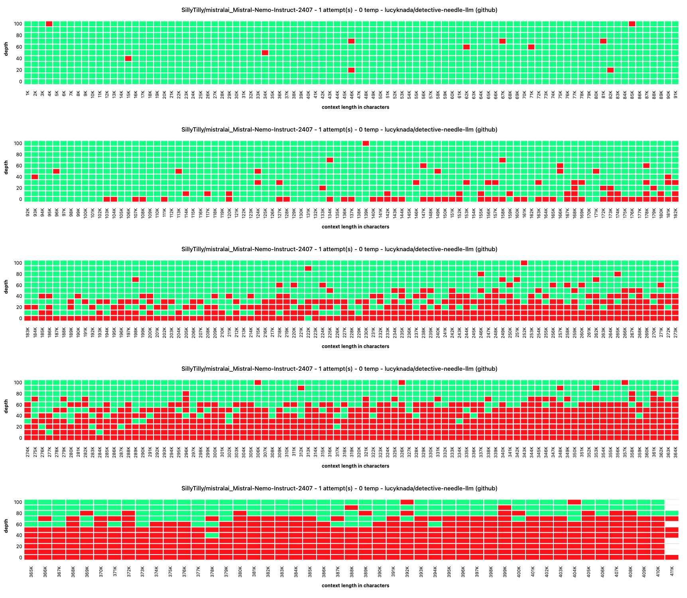

> [!NOTE]
> the x-axis is in characters, not in tokens, tokenization before each run is a future endeavour, but I also like how lightweight it makes it, not having to rely on tokenizers and also giving an idea of how much tokens map to in reality (e.g. 32k context being 128k~ characters, makes summarizing multiple news articles extremely viable!)

# detective needle test

a "deterministic"(1) way to needle test without AI judges, compatible with all oAI endpoints, including tabby and vllm.

no dependencies, just copy `config.example.json` to `config.json`, edit the options and run `node index.js`, once done open up `index.html` in your webbrowser.

while the test is running, it'll keep writing its results, so you can refresh the html page to see the progress so far, a new test run will overwrite it currently.

the neat thing about ENDPOINTS being an array in the config is that you can host multiple backends on e.g. runpod or vast to get through the test faster.

# what is a needle test?

A needle test allows testing the recall ability of an LLM. It works by inserting a tiny fact in a long context (LLM input), and then tests whether the LLM is capable of answering a question about this fact.

# chart examples

# historical charts

as development progressed, the chart type has changed, but since running these tests cost me a lot, I want to at least publish those findings here as a historical charts section

(1) deterministic in quotes because there's no AI judge, the test itself was meant to allow the model to have multiple needle tests with temp 1, so no 2 runs will be the exact same unless you set temp 0
