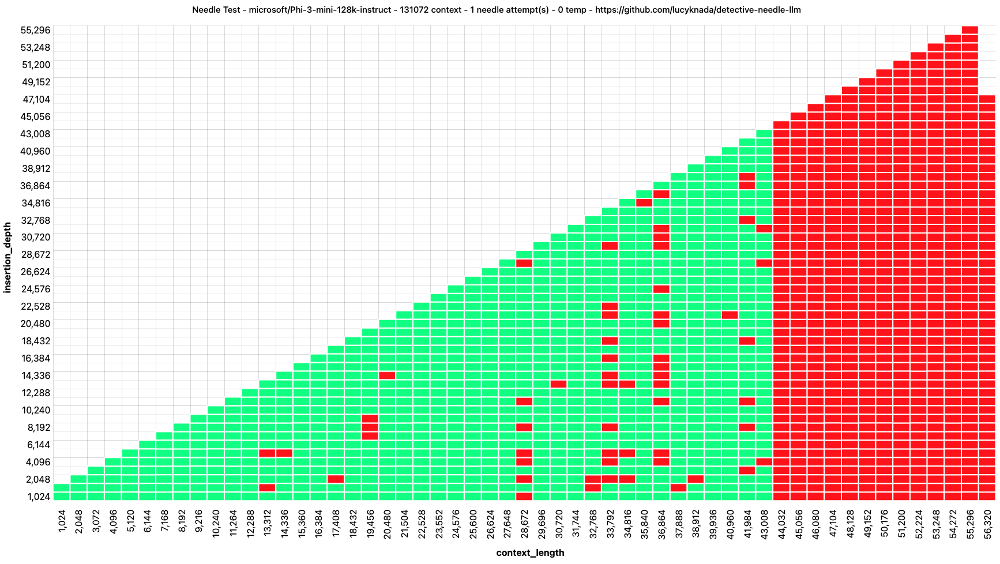

# detective needle test

a "deterministic"(1) way to needle test without AI judges, compatible with all oAI endpoints, including tabby and vllm.

no dependencies, just copy `config.example.json` to `config.json`, edit the options and run `node index.js`, once done open up `index.html` or `legacy.html` in your webbrowser.

while the test is running, it'll keep writing its results, so you can refresh the html page to see the progress so far, a new test run will overwrite it currently.

the neat thing about ENDPOINTS being an array in the config is that you can host multiple backends on e.g. runpod or vast to get through the test faster.

# what is a needle test?

A needle test allows testing the recall ability of an LLM. It works by inserting a tiny fact in a long context (LLM input), and then tests whether the LLM is capable of answering a question about this fact.

# chart example

(1) deterministic in quotes because there's no AI judge, the test itself was meant to allow the model to have multiple needle tests with temp 1, so no 2 runs will be the exact same unless you set temp 0
