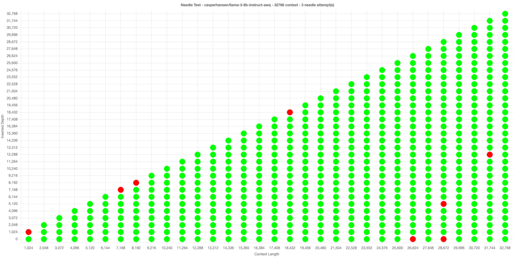

# detective needle test

a deterministic way to needle test without AI judges, compatible with all oAI endpoints, including tabby and vllm.

no dependencies, just copy `config.example.json` to `config.json`, edit the options and run `node index.js`, once done open up `index.html` in your webbrowser.

